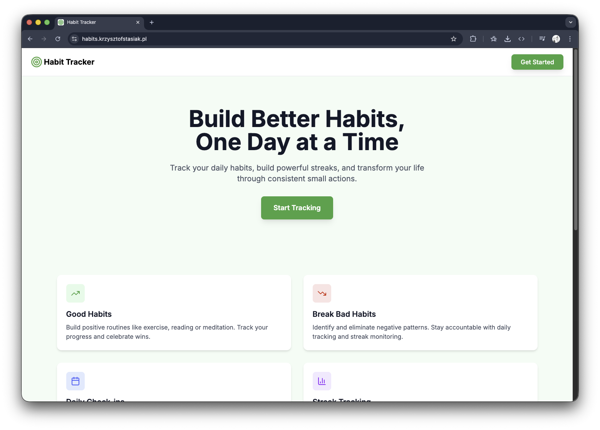
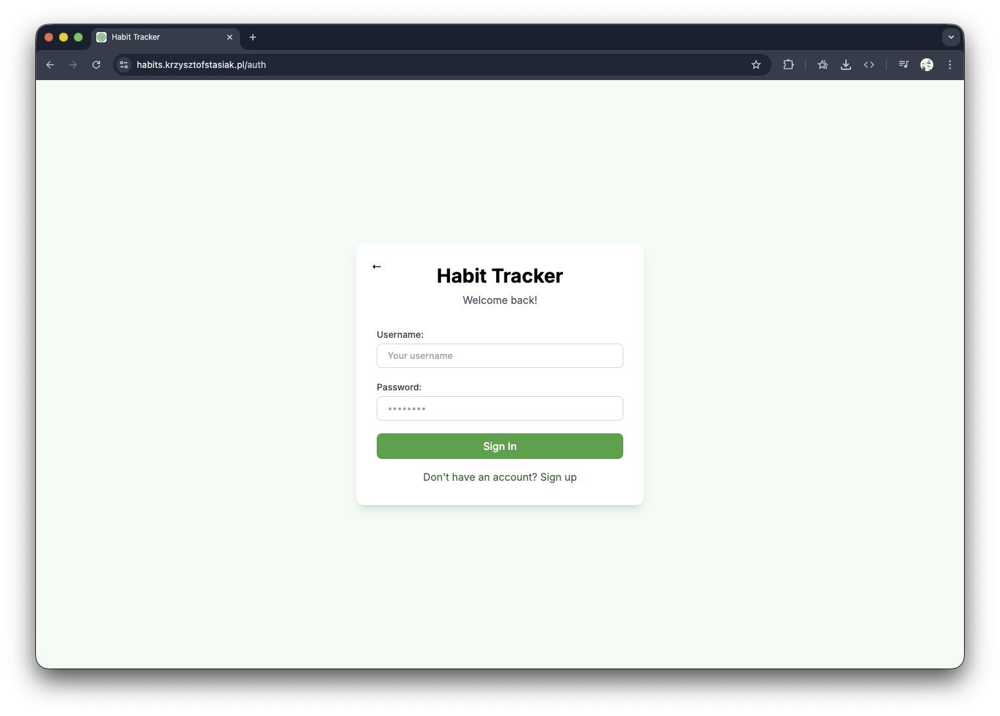
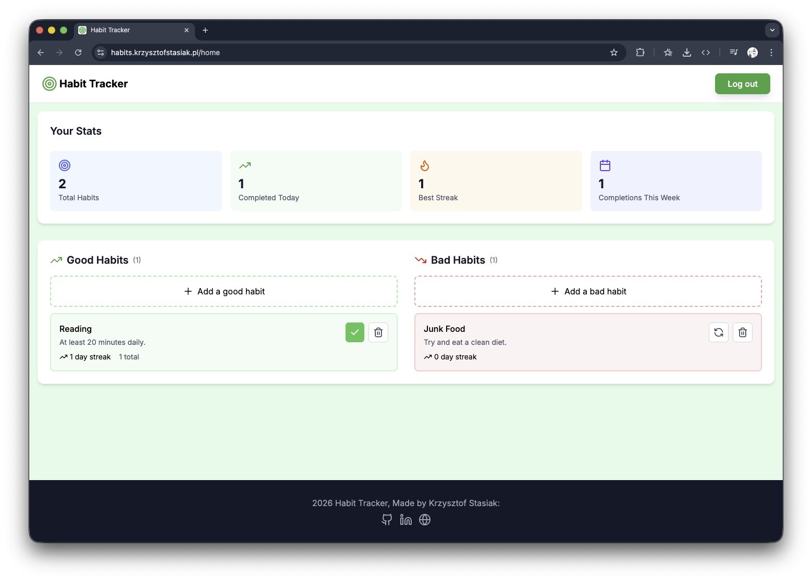

# Habit Tracker

A full-stack habit tracking application for building good habits and breaking bad ones. Track daily streaks, monitor weekly progress, and stay consistent.

**Live demo:** [habits.krzysztofstasiak.pl](https://habits.krzysztofstasiak.pl)
There is a live demo available that is hosted on a VPS.

## Screenshots





## Features

- Track good habits with daily check-ins and streak counting
- Monitor bad habits with a days-clean counter and reset functionality
- Dashboard with stats: total habits, completions today, best streak, completions this week
- JWT authentication with automatic token refresh
- Fully responsive UI

## Tech Stack

### Backend

- Python / Django 6 + Django REST Framework
- PostgreSQL
- JWT auth via `djangorestframework-simplejwt`

### Frontend

- Vue 3 + TypeScript
- Pinia (state management)
- Vue Router
- Tailwind CSS 4
- Axios

### Infrastructure

- Docker + Docker Compose
- Nginx (frontend serving)
- Traefik v3 (reverse proxy, SSL)
- Hetzner VPS
- GitHub Actions (CI - runs Django tests on every push)

## Running locally

**Prerequisites:** Docker, Docker Compose

1. Clone the repo

```bash
git clone https://github.com/krz-sta/habit-tracker.git
cd habit-tracker
```

2. Create `.env` in the root directory:

```env
SECRET_KEY=your-secret-key
DB_NAME=habittracker
DB_USER=postgres
DB_PASSWORD=your-password
DB_HOST=db
DEBUG=True
ALLOWED_HOSTS=localhost,127.0.0.1
CORS_ALLOWED_ORIGINS=http://localhost,http://localhost:80,http://localhost:517
```

3. Start the containers:

```bash
docker compose up --build
```

4. Run migrations:

```bash
docker compose exec backend python manage.py migrate
```

5. Open [http://localhost](http://localhost)

## Running tests

```bash
cd backend
python manage.py test
```

## License

MIT
